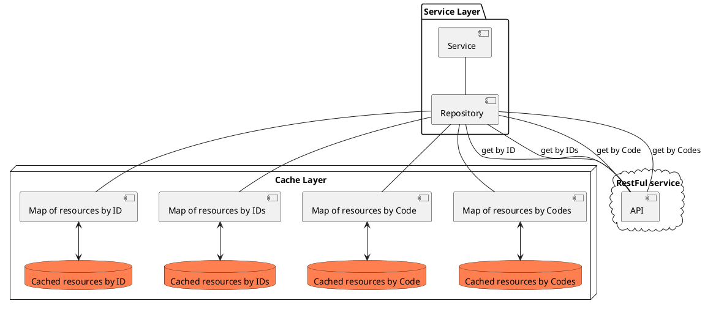
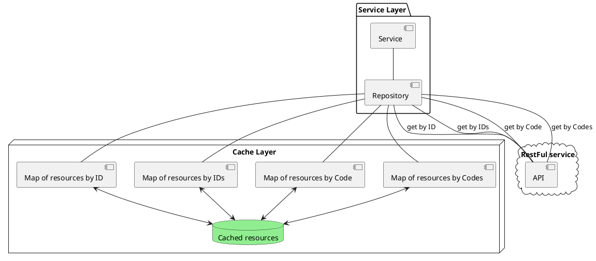

# Motivation

## transform this

```plantuml
@startuml
package "Service Layer" {
  [Service] -- [Repository]
}
node "Cache Layer" {
  [Repository] -- [Map of resources by ID]
  [Repository] -- [Map of resources by IDs]
  [Repository] -- [Map of resources by Code]
  [Repository] -- [Map of resources by Codes]
  
  [Map of resources by ID] <--> [Cached resources by ID]
  [Map of resources by IDs] <--> [Cached resources by IDs]
  [Map of resources by Code] <--> [Cached resources by Code]
  [Map of resources by Codes] <--> [Cached resources by Codes]
}
database "Cached resources by ID" #Coral {
}
database "Cached resources by IDs" #Coral {
}
database "Cached resources by Code" #Coral{
}
database "Cached resources by Codes" #Coral {
}
cloud "RestFul service" {
    [API]
}
[Repository] -- [API] : get by ID
[Repository] -- [API] : get by IDs
[Repository] -- [API] : get by Code
[Repository] -- [API] : get by Codes
@enduml
```
## to this

```plantuml
@startuml
package "Service Layer" {
  [Service] -- [Repository]
}
node "Cache Layer" {
  [Repository] -- [Map of resources by ID]
  [Repository] -- [Map of resources by IDs]
  [Repository] -- [Map of resources by Code]
  [Repository] -- [Map of resources by Codes]

  [Map of resources by ID] <--> [Cached resources]
  [Map of resources by IDs] <--> [Cached resources]
  [Map of resources by Code] <--> [Cached resources]
  [Map of resources by Codes] <--> [Cached resources]
}
database "Cached resources" #LightGreen {
}
cloud "RestFul service" {
    [API]
}
[Repository] -- [API] : get by ID
[Repository] -- [API] : get by IDs
[Repository] -- [API] : get by Code
[Repository] -- [API] : get by Codes
@enduml
```